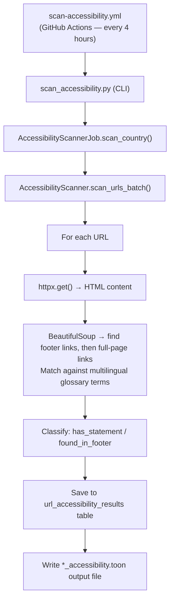

<!-- ACCESSIBILITY_STATS_START -->

_Stats as of 2026-07-23 22:35 UTC — last scan: 2026-07-23_

**29** scan batches run

**14,620** of **87,696** available pages scanned (**16.7%** coverage)
**13,259** of **14,620** scanned pages were reachable (**90.7%**)
**5,939** of **13,259** reachable pages have an accessibility statement (**44.8%**)
**5,303** pages have the statement link in the footer (**89.3%** of pages with a statement)

📥 Machine-readable results are available as the [accessibility-data.json artifact (machine-readable JSON)](https://github.com/mgifford/eu-plus-government-scans/actions/workflows/generate-scan-progress.yml).

Each country entry in the JSON file includes page-level evidence for pages with and without accessibility statements, plus a per-domain summary you can share to validate the published counts.

> Hover or focus any non-zero count in the country table to preview the matching pages. If there are 20 or fewer URLs, the preview shows all of them; otherwise it shows a short sample. Full machine-readable data is available as the [accessibility-data.json artifact (machine-readable JSON)](https://github.com/mgifford/eu-plus-government-scans/actions/workflows/generate-scan-progress.yml).

---

## Accessibility Statement Scan by Country

| Country | Scanned | Available | Reachable | Has Statement | In Footer | Statement % | Scan Period |
|---------|---------|-----------|-----------|--------------|-----------|------------|-------------|
| Austria | 822 | 822 | 787 | 556 | 525 | 70.6% | Jul 2026 |
| Belgium | 712 | 1,329 | 653 | 306 | 280 | 46.9% | Jul 2026 |
| Bulgaria | 353 | 353 | 316 | 98 | 87 | 31.0% | Jul 2026 |
| Canada | 665 | 4,469 | 583 | 120 | 91 | 20.6% | Jul 2026 |
| Croatia | 257 | 257 | 254 | 107 | 82 | 42.1% | Jul 2026 |
| Czechia | 866 | 866 | 796 | 429 | 373 | 53.9% | Jul 2026 |
| Denmark | 469 | 1,536 | 463 | 300 | 288 | 64.8% | Jul 2026 |
| Estonia | 401 | 401 | 384 | 148 | 78 | 38.5% | Jul 2026 |
| Finland | 199 | 199 | 188 | 134 | 127 | 71.3% | Jul 2026 |
| France | 630 | 10,009 | 559 | 152 | 149 | 27.2% | Jul 2026 |
| Germany | 1,029 | 6,599 | 976 | 656 | 597 | 67.2% | Jul 2026 |
| Greece | 1,132 | 1,752 | 1,046 | 209 | 140 | 20.0% | Jul 2026 |
| Hungary | 392 | 392 | 296 | 54 | 46 | 18.2% | Jul 2026 |
| Iceland | 145 | 145 | 143 | 12 | 5 | 8.4% | Jul 2026 |
| Ireland | 536 | 536 | 496 | 216 | 203 | 43.5% | Jul 2026 |
| Italy | 308 | 5,351 | 293 | 237 | 237 | 80.9% | Jul 2026 |
| Latvia | 803 | 803 | 761 | 489 | 448 | 64.3% | Jul 2026 |
| Lithuania | 122 | 122 | 111 | 1 | 0 | 0.9% | Jul 2026 |
| Luxembourg | 212 | 573 | 138 | 90 | 86 | 65.2% | Jul 2026 |
| Malta | 610 | 610 | 592 | 381 | 376 | 64.4% | Jul 2026 |
| Netherlands | 945 | 945 | 899 | 414 | 406 | 46.1% | Jul 2026 |
| Norway | 249 | 249 | 242 | 109 | 101 | 45.0% | Jul 2026 |
| Poland | 353 | 14,951 | 340 | 76 | 45 | 22.4% | Jul 2026 |
| Portugal | 1,087 | 3,508 | 907 | 167 | 133 | 18.4% | Jul 2026 |
| Cyprus | 29 | 29 | 28 | 1 | 1 | 3.6% | Jul 2026 |
| Romania | 217 | 807 | 68 | 8 | 2 | 11.8% | Jul 2026 |
| Slovakia | 442 | 442 | 415 | 191 | 172 | 46.0% | Jul 2026 |
| Slovenia | 214 | 214 | 201 | 109 | 74 | 54.2% | Jul 2026 |
| Spain | 423 | 6,091 | 326 | 171 | 153 | 52.5% | Jul 2026 |
| **Total** | **14,622** | **87,696** | **13,261** | **5,941** | **5,305** | **44.8%** | — |

> **Statement %** is the percentage of *reachable* pages that contain at least one link to an accessibility statement.

<!-- ACCESSIBILITY_STATS_END -->

---

## Overview

The accessibility statement scanner checks whether each government page links
to an **accessibility statement** as required by the
[EU Web Accessibility Directive (Directive 2016/2102)](https://eur-lex.europa.eu/legal-content/EN/TXT/?uri=CELEX%3A32016L2102).

Under the Directive, public-sector bodies must:

1. Publish an accessibility statement describing the accessibility of their
   website or mobile app.
2. Include a clearly labelled link to that statement on the page, ideally in
   the footer.

The scanner detects these links using multilingual term matching across all
**24 EU official languages** plus Norwegian and Icelandic.

Scans run **automatically every 4 hours** via GitHub Actions so that the full
set of ~80,000 URLs across 31 countries can be covered gradually without
overloading government servers.

---

## What Is Checked

For each scanned page the scanner:

1. Fetches the page HTML.
2. Searches **first inside `<footer>` elements** for links whose text or href
   matches known accessibility-statement terminology.
3. If not found in the footer, searches the **entire page**.
4. Records whether a matching link was found, where it was found (footer or
   page body), and what text triggered the match.

---

## Multilingual Term Matching

The glossary covers the following languages:

| Region | Languages |
|--------|----------|
| EU official languages | Bulgarian, Croatian, Czech, Danish, Dutch, English, Estonian, Finnish, French, German, Greek, Hungarian, Irish, Italian, Latvian, Lithuanian, Maltese, Polish, Portuguese, Romanian, Slovak, Slovenian, Spanish, Swedish |
| Allied nations | Icelandic, Norwegian |

Example recognised terms include *"accessibility statement"* (EN),
*"déclaration d'accessibilité"* (FR), *"Erklärung zur Barrierefreiheit"* (DE),
and equivalents in all supported languages.

---

## Tier Classification

Each scanned page is assigned one of three outcomes:

| Outcome | Meaning |
|---------|---------|
| `unreachable` | Page could not be fetched (network error, timeout, 4xx/5xx) |
| `no_statement` | Page is reachable but no accessibility statement link was found |
| `has_statement` | Page contains at least one link to an accessibility statement |

Pages where the statement link was found inside a `<footer>` element are
additionally flagged with `found_in_footer = true`, since placing the link in
the footer is considered best practice.

---

## Viewing Results

### Scan Progress Report

The **[Scan Progress Report](scan-progress.md)** includes a per-country
accessibility statement breakdown showing:

- Total pages scanned and reachable count
- Number of pages with a statement link
- Number of pages where the link was found in the footer
- Date range showing when each country was last scanned

### GitHub Actions Artifacts

Each workflow run uploads a scan artifact containing:

- `data/metadata.db` — the full SQLite results database
- `accessibility-scan-output.txt` — the raw scan log
- `data/toon-seeds/countries/**_accessibility.toon` — annotated TOON files

To download artifacts:

1. Go to [GitHub Actions → Scan Accessibility Statements](https://github.com/mgifford/eu-plus-government-scans/actions/workflows/scan-accessibility.yml)
2. Click on the relevant workflow run
3. Scroll to the **Artifacts** section at the bottom of the run summary page
4. Download `accessibility-scan-<run_number>` to inspect the database or TOON files

---

## Running a Scan Manually

### Via GitHub Actions (recommended)

1. Go to [Actions → Scan Accessibility Statements](https://github.com/mgifford/eu-plus-government-scans/actions/workflows/scan-accessibility.yml)
2. Click **Run workflow**
3. Optionally enter a country code (e.g. `ICELAND`) or leave blank to scan all
4. Optionally adjust the rate limit (default: 1.0 req/sec)

### Via the command line

```bash
# Scan a single country
python3 -m src.cli.scan_accessibility --country ICELAND --rate-limit 1.0

# Scan all countries (with a 110-minute runtime cap)
python3 -m src.cli.scan_accessibility --all --max-runtime 110 --rate-limit 1.0
```

---

## Output Format

### Annotated TOON file (`*_accessibility.toon`)

Each page entry gains an `accessibility` field:

```json
{
  "url": "https://example.gov/",
  "is_root_page": true,
  "accessibility": {
    "is_reachable": true,
    "has_statement": true,
    "found_in_footer": true,
    "statement_links": ["https://example.gov/accessibility"],
    "matched_terms": ["accessibility statement"]
  }
}
```

### Database table (`url_accessibility_results`)

| Column | Type | Description |
|--------|------|-------------|
| `url` | TEXT | Page URL |
| `country_code` | TEXT | Country identifier (e.g. `ICELAND`) |
| `scan_id` | TEXT | Unique scan run identifier |
| `is_reachable` | INTEGER | 1 = reachable, 0 = not reachable |
| `has_statement` | INTEGER | 1 = accessibility statement link found |
| `found_in_footer` | INTEGER | 1 = link was found inside a `<footer>` element |
| `statement_links` | TEXT | JSON list of resolved statement URLs |
| `matched_terms` | TEXT | JSON list of matched glossary terms |
| `error_message` | TEXT | Error message if fetch failed |
| `scanned_at` | TEXT | ISO-8601 timestamp of scan |

---

## Countries Covered

Scans cover all 27 EU member states plus 4 allied nations:

| Region | Countries |
|--------|----------|
| EU member states | Austria, Belgium, Bulgaria, Croatia, Czechia, Denmark, Estonia, Finland, France, Germany, Greece, Hungary, Ireland, Italy, Latvia, Lithuania, Luxembourg, Malta, Netherlands, Poland, Portugal, Republic of Cyprus, Romania, Slovakia, Slovenia, Spain, Sweden |
| Allied nations | Iceland, Norway, Switzerland, United Kingdom |

---

## Architecture


