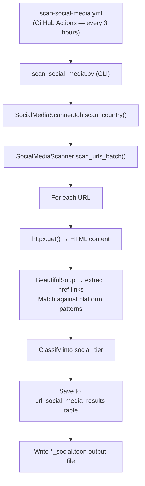

<!-- SOCIAL_MEDIA_STATS_START -->

<div id="sm-tier-pie-container" style="float:right;margin:0 0 1rem 1.5rem;width:260px;max-width:45%;">
<svg role="img" aria-labelledby="pie-title pie-desc" viewBox="0 0 240 314" width="240" height="314" xmlns="http://www.w3.org/2000/svg">
<title id="pie-title">Social media tier distribution</title>
<desc id="pie-desc">Pie chart: social media tier distribution across 11,417 scanned pages. Legacy only: 3,250 (28.5%), Modern only: 15 (0.1%), Mixed: 747 (6.5%), No Social: 6,555 (57.4%)</desc>
<path d="M 120,110 L 120.000,20.000 A 90,90 0 0,1 204.178,141.845 Z" fill="#1a8cd8" stroke="#fff" stroke-width="1"><title>Twitter/X only: 3,250 (30.8%)</title></path>
<path d="M 120,110 L 204.178,141.845 A 90,90 0 0,1 203.890,142.595 Z" fill="#0085ff" stroke="#fff" stroke-width="1"><title>Modern only: 15 (0.1%)</title></path>
<path d="M 120,110 L 203.890,142.595 A 90,90 0 0,1 181.744,175.480 Z" fill="#7856ff" stroke="#fff" stroke-width="1"><title>Mixed: 747 (7.1%)</title></path>
<path d="M 120,110 L 181.744,175.480 A 90,90 0 1,1 120.000,20.000 Z" fill="#cccccc" stroke="#fff" stroke-width="1"><title>No Social: 6,555 (62.0%)</title></path>
<rect x="20" y="216" width="14" height="14" fill="#1a8cd8"/>
<text x="40" y="227" font-size="11" font-family="sans-serif" fill="#333">Twitter/X only (30.8%)</text>
<rect x="20" y="238" width="14" height="14" fill="#0085ff"/>
<text x="40" y="249" font-size="11" font-family="sans-serif" fill="#333">Modern only (0.1%)</text>
<rect x="20" y="260" width="14" height="14" fill="#7856ff"/>
<text x="40" y="271" font-size="11" font-family="sans-serif" fill="#333">Mixed (7.1%)</text>
<rect x="20" y="282" width="14" height="14" fill="#cccccc"/>
<text x="40" y="293" font-size="11" font-family="sans-serif" fill="#333">No Social (62.0%)</text>
</svg>
<p style="text-align:center;font-size:0.75em;margin:0.3rem 0 0;color:#555;font-style:italic;">Social media tier distribution</p>
</div>

_Stats as of 2026-08-13 21:02 UTC — last scan: 2026-08-13_

**19** scan batches run

**11,416** of **87,696** available pages scanned (**13.0%** coverage)
**10,566** of **11,416** scanned pages were reachable (**92.6%**)

**Legacy social media** (older, centralised platforms):

| Platform | Pages with link | % of scanned | % of reachable |
|----------|----------------|:------------:|:--------------:|
| 🐦 Twitter | **1,638** | 14.3% | 15.5% |
| ✖ X | **315** | 2.8% | 3.0% |
| 👍 Facebook | **3,576** | 31.3% | 33.8% |
| 💼 LinkedIn | **1,674** | 14.7% | 15.8% |

**Modern / open social media** (decentralised or open platforms):

| Platform | Pages with link | % of scanned | % of reachable |
|----------|----------------|:------------:|:--------------:|
| 🦋 Bluesky | **226** | 2.0% | 2.1% |
| 🐘 Mastodon / Fediverse | **579** | 5.1% | 5.5% |

<div style="clear:both;"></div>

📥 Machine-readable results are available as the [social-media-data.json artifact (machine-readable JSON)](https://github.com/mgifford/eu-plus-government-scans/actions/workflows/generate-scan-progress.yml).

---

## Digital Sovereignty Rankings

Countries ranked by **Digital Sovereignty Score** — the percentage of reachable pages using *no social media* or *modern open platforms only* (Mastodon / Bluesky).  A higher score means fewer links to US corporate social-media platforms (Twitter / X, Facebook, LinkedIn).  Pages with no social-media links at all score highest; pages linking only to Mastodon or Bluesky also rank well.  **Legacy Exposure** shows the percentage of reachable pages that still link to Twitter/X, Facebook, or LinkedIn.

| Rank | Country | Sovereignty Score | No Social | Modern Only | Legacy Exposure | Tier |
|------|---------|:-----------------:|:---------:|:-----------:|:---------------:|------|
| 1 | France | 76.5% | 577 | 3 | 23.5% | 🥉 Growing |
| 2 | Lithuania | 72.3% | 81 | 0 | 27.7% | 🥉 Growing |
| 3 | Iceland | 72.0% | 103 | 0 | 28.0% | 🥉 Growing |
| 4 | Greece | 70.9% | 777 | 1 | 29.1% | 🥉 Growing |
| 5 | Germany | 69.8% | 636 | 3 | 30.2% | 🥉 Growing |
| 6 | Canada | 69.7% | 790 | 0 | 30.3% | 🥉 Growing |
| 7 | Bulgaria | 68.8% | 208 | 1 | 31.2% | 🥉 Growing |
| 8 | Estonia | 64.8% | 46 | 0 | 35.2% | 🥉 Growing |
| 9 | Denmark | 63.4% | 950 | 0 | 36.6% | 🥉 Growing |
| 10 | Czechia | 63.0% | 498 | 2 | 37.0% | 🥉 Growing |
| 11 | Belgium | 60.7% | 277 | 2 | 39.3% | 🥉 Growing |
| 12 | Croatia | 59.1% | 149 | 0 | 40.9% | 🥉 Growing |
| 13 | Finland | 56.9% | 103 | 0 | 43.1% | 🥉 Growing |
| 14 | Austria | 54.2% | 423 | 2 | 45.8% | 🥉 Growing |
| 15 | Hungary | 53.4% | 155 | 1 | 46.6% | 🥉 Growing |
| 16 | Ireland | 49.5% | 247 | 0 | 50.5% | 🥉 Growing |
| 17 | Luxembourg | 48.3% | 185 | 0 | 51.7% | 🥉 Growing |
| 18 | Latvia | 41.0% | 311 | 0 | 59.0% | 🥉 Growing |
| 19 | Italy | 29.3% | 39 | 0 | 70.7% | ⚠️ Legacy-heavy |

---

## Social Media Scan by Country

**Available**: all government pages tracked in our domain list. **Reachable**: of those scanned, pages that returned a valid HTTP response (not an error or timeout). **Sov. Score**: Digital Sovereignty Score — % of reachable pages with no social media or modern-only social presence. Tier columns classify each page by its overall social media presence; platform columns count pages with at least one link to that platform — a page may appear in more than one platform column.

| Country | Scanned | Available | Reachable | Sov. Score | No Social | Legacy-only | Twitter | X | Facebook | LinkedIn | Modern | Mixed | Bluesky | Mastodon | Scan Period |
|---------|---------|-----------|-----------|:----------:|-----------|-------------|---------|---|----------|----------|--------|-------|---------|----------|-------------|
| Austria | 822 | 822 | 784 | 54.2% | 423 | 312 | 32 | 20 | 350 | 184 | 2 | 47 | 16 | 44 | Aug 2026 |
| Belgium | 500 | 1,329 | 460 | 60.7% | 277 | 147 | 53 | 37 | 168 | 125 | 2 | 34 | 4 | 32 | Aug 2026 |
| Bulgaria | 353 | 353 | 304 | 68.8% | 208 | 77 | 20 | 6 | 91 | 10 | 1 | 18 | 0 | 19 | Aug 2026 |
| Canada | 1,180 | 4,469 | 1,133 | 69.7% | 790 | 309 | 91 | 12 | 320 | 140 | 0 | 34 | 10 | 30 | Aug 2026 |
| Croatia | 257 | 257 | 252 | 59.1% | 149 | 87 | 53 | 8 | 96 | 35 | 0 | 16 | 0 | 16 | Aug 2026 |
| Czechia | 866 | 866 | 794 | 63.0% | 498 | 258 | 138 | 22 | 280 | 37 | 2 | 36 | 0 | 38 | Aug 2026 |
| Denmark | 1,536 | 1,536 | 1,498 | 63.4% | 950 | 527 | 164 | 20 | 447 | 323 | 0 | 21 | 17 | 7 | Aug 2026 |
| Estonia | 80 | 401 | 71 | 64.8% | 46 | 22 | 11 | 0 | 25 | 10 | 0 | 3 | 0 | 3 | Aug 2026 |
| Finland | 199 | 199 | 181 | 56.9% | 103 | 69 | 31 | 10 | 55 | 65 | 0 | 9 | 3 | 6 | Aug 2026 |
| France | 858 | 10,009 | 758 | 76.5% | 577 | 155 | 83 | 10 | 148 | 62 | 3 | 23 | 13 | 18 | Aug 2026 |
| Germany | 972 | 6,599 | 915 | 69.8% | 636 | 180 | 167 | 12 | 173 | 108 | 3 | 96 | 16 | 92 | Aug 2026 |
| Greece | 1,189 | 1,752 | 1,097 | 70.9% | 777 | 260 | 130 | 39 | 307 | 72 | 1 | 59 | 0 | 60 | Aug 2026 |
| Hungary | 392 | 392 | 292 | 53.4% | 155 | 112 | 23 | 0 | 132 | 12 | 1 | 24 | 0 | 25 | Aug 2026 |
| Iceland | 145 | 145 | 143 | 72.0% | 103 | 24 | 8 | 6 | 40 | 7 | 0 | 16 | 0 | 16 | Aug 2026 |
| Ireland | 536 | 536 | 499 | 49.5% | 247 | 189 | 151 | 38 | 213 | 103 | 0 | 63 | 18 | 51 | Aug 2026 |
| Italy | 147 | 5,351 | 133 | 29.3% | 39 | 77 | 74 | 14 | 83 | 21 | 0 | 17 | 0 | 17 | Aug 2026 |
| Latvia | 803 | 803 | 758 | 41.0% | 311 | 356 | 267 | 55 | 433 | 173 | 0 | 91 | 0 | 91 | Aug 2026 |
| Lithuania | 122 | 122 | 112 | 72.3% | 81 | 27 | 5 | 1 | 31 | 20 | 0 | 4 | 0 | 4 | Aug 2026 |
| Luxembourg | 460 | 573 | 383 | 48.3% | 185 | 62 | 138 | 6 | 185 | 167 | 0 | 136 | 129 | 10 | Aug 2026 |
| **Total** | **11,417** | **87,696** | **10,567** | **62.2%** | **6,555** | **3,250** | **1,639** | **316** | **3,577** | **1,674** | **15** | **747** | **226** | **579** | — |

> Hover or focus any non-zero country-table count to preview matching pages. Activate the number to keep the preview open. Full machine-readable data is available as the [social-media-data.json artifact (machine-readable JSON)](https://github.com/mgifford/eu-plus-government-scans/actions/workflows/generate-scan-progress.yml).

<!-- SOCIAL_MEDIA_STATS_END -->

---

## Overview

The social media scanner fetches each government page and inspects the HTML for
links to known social platforms. Results are stored in the metadata database
and published to this site via the [Scan Progress Report](scan-progress.md).

Scans run **automatically every 3 hours** via GitHub Actions so that the full
set of ~80,000 URLs across 31 countries can be covered gradually without
overloading government servers.

---

## Platforms Tracked

### Legacy Social Media (older, centralised platforms)

| Platform | Domains detected |
|----------|-----------------|
| **Twitter** | `twitter.com` |
| **X** | `x.com` |
| **Facebook** | `facebook.com`, `fb.com` |
| **LinkedIn** | `linkedin.com` |

### Modern / Open Social Media (decentralised or open platforms)

| Platform | Domains detected |
|----------|-----------------|
| **Bluesky** | `bsky.app`, `bsky.social` |
| **Mastodon / Fediverse** | 40+ known instances + `/@username` pattern detection |

---

## Tier Classification

Each scanned page is assigned one of five tiers:

| Tier | Meaning |
|------|---------|
| `unreachable` | Page could not be fetched (network error, timeout, 4xx/5xx) |
| `no_social` | Page is reachable but contains no recognised social media links |
| `twitter_only` | Page links only to legacy platforms (Twitter, X, Facebook, or LinkedIn) |
| `modern_only` | Page links only to Bluesky or Mastodon (modern / open platforms) |
| `mixed` | Page links to at least one legacy platform **and** at least one modern platform |

---

## Viewing Results

### Scan Progress Report

The **[Scan Progress Report](scan-progress.md)** is regenerated after every
scan and shows per-country breakdowns including:

- Total URLs scanned and reachable count
- Tier distribution (twitter-only / modern / mixed / no-social / unreachable)
- Per-platform link counts (Twitter, X, Bluesky, Mastodon)
- Date range showing when each country was last scanned

### GitHub Actions Artifacts

Each workflow run also uploads a scan artifact containing:

- `data/metadata.db` — the full SQLite results database
- `social-scan-output.txt` — the raw scan log
- `data/toon-seeds/countries/**_social.toon` — annotated TOON files

To download artifacts:

1. Go to [GitHub Actions → Scan Social Media Links](https://github.com/mgifford/eu-plus-government-scans/actions/workflows/scan-social-media.yml)
2. Click on the relevant workflow run
3. Scroll to the **Artifacts** section at the bottom of the run summary page
4. Download `social-scan-<run_number>` to inspect the database or TOON files

---

## Running a Scan Manually

### Via GitHub Actions (recommended)

1. Go to [Actions → Scan Social Media Links](https://github.com/mgifford/eu-plus-government-scans/actions/workflows/scan-social-media.yml)
2. Click **Run workflow**
3. Optionally enter a country code (e.g. `ICELAND`) or leave blank to scan all
4. Optionally adjust the rate limit (default: 1.0 req/sec)

### Via the command line

```bash
# Scan a single country
python3 -m src.cli.scan_social_media --country ICELAND --rate-limit 1.0

# Scan all countries (with a 110-minute runtime cap)
python3 -m src.cli.scan_social_media --all --max-runtime 110 --rate-limit 1.0
```

---

## Output Format

### Annotated TOON file (`*_social.toon`)

Each page entry gains a `social_media` field:

```json
{
  "url": "https://example.gov/",
  "is_root_page": true,
  "social_media": {
    "is_reachable": true,
    "social_tier": "mixed",
    "twitter_links": ["https://twitter.com/example_gov"],
    "x_links": [],
    "facebook_links": [],
    "linkedin_links": [],
    "bluesky_links": ["https://bsky.app/profile/example.bsky.social"],
    "mastodon_links": []
  }
}
```

### Database table (`url_social_media_results`)

| Column | Type | Description |
|--------|------|-------------|
| `url` | TEXT | Page URL |
| `country_code` | TEXT | Country identifier (e.g. `ICELAND`) |
| `scan_id` | TEXT | Unique scan run identifier |
| `is_reachable` | INTEGER | 1 = reachable, 0 = not reachable |
| `twitter_links` | TEXT | JSON list of `twitter.com` hrefs found |
| `x_links` | TEXT | JSON list of `x.com` hrefs found |
| `facebook_links` | TEXT | JSON list of `facebook.com` / `fb.com` hrefs found |
| `linkedin_links` | TEXT | JSON list of `linkedin.com` hrefs found |
| `bluesky_links` | TEXT | JSON list of Bluesky hrefs found |
| `mastodon_links` | TEXT | JSON list of Mastodon hrefs found |
| `social_tier` | TEXT | Tier classification (see above) |
| `scanned_at` | TEXT | ISO-8601 timestamp of scan |

---

## Countries Covered

Scans cover all 27 EU member states plus 4 allied nations:

| Region | Countries |
|--------|----------|
| EU member states | Austria, Belgium, Bulgaria, Croatia, Czechia, Denmark, Estonia, Finland, France, Germany, Greece, Hungary, Ireland, Italy, Latvia, Lithuania, Luxembourg, Malta, Netherlands, Poland, Portugal, Republic of Cyprus, Romania, Slovakia, Slovenia, Spain, Sweden |
| Allied nations | Iceland, Norway, Switzerland, United Kingdom |

See also the **[Government Domains](domains.md)** page for a full listing of
all domains tracked per country.

---

## Architecture


