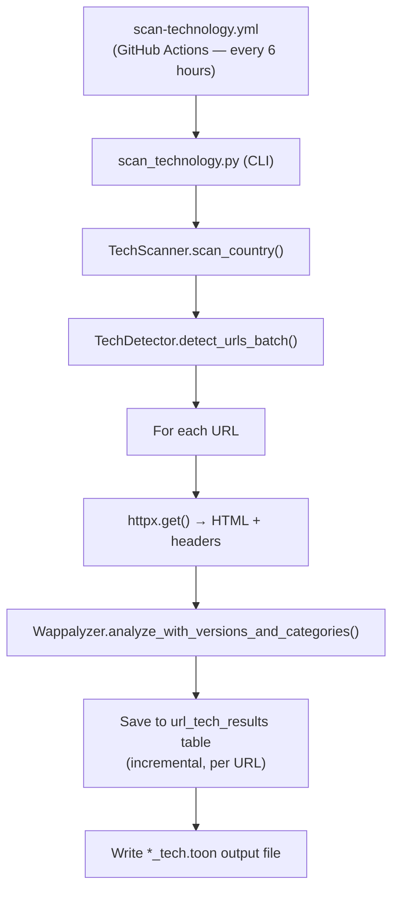

<!-- TECH_STATS_START -->

_Stats as of 2026-09-21 19:28 UTC — last scan: 2026-09-21_

**180** scan batches run

**87,690** of **87,696** available pages scanned (**100.0%** coverage)
**65,576** pages with technology detections (**74.8%** of scanned)
**459** unique technologies identified

---

## Technology Scan by Country

| Country | URLs Scanned | Pages with Detections | Available | Last Scan |
|---------|-------------|----------------------|-----------|----------|
| Austria | 822 | 785 | 822 | 2026-09-11 |
| Belgium | 1,329 | 1,217 | 1,329 | 2026-09-15 |
| Bulgaria | 353 | 298 | 353 | 2026-09-11 |
| Canada | 4,469 | 4,200 | 4,469 | 2026-09-16 |
| Croatia | 257 | 253 | 257 | 2026-09-11 |
| Czechia | 866 | 790 | 866 | 2026-09-11 |
| Denmark | 1,536 | 1,503 | 1,536 | 2026-09-18 |
| Estonia | 401 | 380 | 401 | 2026-09-11 |
| Finland | 199 | 188 | 199 | 2026-09-11 |
| France | 10,009 | 6,036 | 10,009 | 2026-09-20 |
| Germany | 6,599 | 5,649 | 6,599 | 2026-09-21 |
| Greece | 1,752 | 1,614 | 1,752 | 2026-09-16 |
| Hungary | 392 | 293 | 392 | 2026-09-12 |
| Iceland | 145 | 143 | 145 | 2026-09-12 |
| Ireland | 536 | 494 | 536 | 2026-09-12 |
| Italy | 5,351 | 2,984 | 5,351 | 2026-09-21 |
| Latvia | 803 | 756 | 803 | 2026-09-16 |
| Lithuania | 122 | 112 | 122 | 2026-09-13 |
| Luxembourg | 573 | 513 | 573 | 2026-09-13 |
| Malta | 610 | 592 | 610 | 2026-09-16 |
| Netherlands | 945 | 885 | 945 | 2026-09-13 |
| Norway | 249 | 242 | 249 | 2026-09-13 |
| Poland | 14,951 | 10,575 | 14,951 | 2026-09-19 |
| Portugal | 3,508 | 3,008 | 3,508 | 2026-09-19 |
| Cyprus | 29 | 28 | 29 | 2026-09-13 |
| Romania | 807 | 340 | 807 | 2026-09-20 |
| Slovakia | 442 | 412 | 442 | 2026-09-14 |
| Slovenia | 214 | 207 | 214 | 2026-09-14 |
| Spain | 6,091 | 2,704 | 6,091 | 2026-09-20 |
| Sweden | 1,702 | 1,622 | 1,702 | 2026-09-20 |
| Switzerland | 2,123 | 2,073 | 2,123 | 2026-09-14 |
| United Kingdom | 19,511 | 14,684 | 19,511 | 2026-09-20 |

> Hover or focus any non-zero country-table count to preview matching pages. Activate the number to keep the preview open and download a CSV for that country and metric from [Download machine-readable technology data (JSON)](technology-data.json).

---

### Top Technologies

| # | Technology | Pages | Categories |
|--:|-----------|------:|-----------|
| 1 | jQuery | **35,331** | JavaScript libraries |
| 2 | PHP | **21,938** | Programming languages |
| 3 | Apache | **16,990** | Web servers |
| 4 | Font Awesome | **16,519** | Font scripts |
| 5 | Bootstrap | **15,661** | UI frameworks |
| 6 | Google Tag Manager | **14,550** | Tag managers |
| 7 | Google Font API | **14,350** | Font scripts |
| 8 | MySQL | **12,657** | Databases |
| 9 | WordPress | **12,570** | Blogs, CMS |
| 10 | Nginx | **11,112** | Reverse proxies, Web servers |
| 11 | jQuery Migrate | **11,078** | JavaScript libraries |
| 12 | Cloudflare | **6,531** | CDN |
| 13 | Windows Server | **6,143** | Operating systems |
| 14 | IIS | **6,055** | Web servers |
| 15 | jQuery UI | **5,318** | JavaScript libraries |
| 16 | Microsoft ASP.NET | **5,299** | Web frameworks |
| 17 | Drupal | **4,471** | CMS |
| 18 | reCAPTCHA | **4,414** | Security |
| 19 | jsDelivr | **4,277** | CDN |
| 20 | Yoast SEO | **4,222** | SEO |

### Top Technology Categories

| # | Category | Pages |
|--:|---------|------:|
| 1 | JavaScript libraries | **70,809** |
| 2 | Web servers | **38,914** |
| 3 | Font scripts | **31,924** |
| 4 | Programming languages | **27,544** |
| 5 | CMS | **23,312** |
| 6 | UI frameworks | **20,856** |
| 7 | Tag managers | **14,576** |
| 8 | CDN | **14,563** |
| 9 | Databases | **13,277** |
| 10 | Blogs | **12,726** |
| 11 | Reverse proxies | **11,560** |
| 12 | Operating systems | **9,453** |
| 13 | Web frameworks | **7,678** |
| 14 | JavaScript frameworks | **6,889** |
| 15 | Miscellaneous | **4,961** |

📥 Machine-readable results: [Download machine-readable technology data (JSON)](technology-data.json)

<!-- TECH_STATS_END -->

---

## Overview

The technology scanner fetches each government page and uses
[wappalyzer-python3](https://pypi.org/project/wappalyzer-python3/) to identify
technologies from HTTP response headers and HTML content.  Detected
technologies (CMS, web server, JavaScript frameworks, analytics, etc.) and
their versions are stored in the metadata database and written back into an
annotated `*_tech.toon` TOON file.

Scans run **automatically every 6 hours** via GitHub Actions so that the full
set of URLs across all countries can be covered gradually without overloading
government servers.

---

## License and Digital Public Goods status (Top Technologies)

To support policy tracking of open source and free software use, this page now
includes a machine-readable license registry for the current **Top
Technologies** list:

- [Download technology license data (JSON)](technology-license-data.json)

Current summary from `technology-license-data.json`:

- **DPGA Registry listed:** Drupal
- **OSI-approved license (yes):** jQuery, PHP, Apache, Bootstrap, MySQL,
  WordPress, Nginx, jQuery Migrate, jQuery UI, Drupal, Yoast SEO
- **Partial/mixed:** Font Awesome, Microsoft ASP.NET, jsDelivr
- **Not OSI-approved (no):** Google Font API, Windows Server, IIS,
  Google Tag Manager, Cloudflare, reCAPTCHA

> Notes:
> - This is a best-effort mapping of detected technology names to primary
>   upstream licenses.
> - Some detections are products/services (not single software packages), so
>   their licensing model can be mixed or proprietary.
> - DPGA status is based on a checked snapshot at generation time and may change.

---

## Usage

### Scan a single country

```bash
python3 -m src.cli.scan_technology --country ICELAND --rate-limit 2
```

### Scan all countries

```bash
python3 -m src.cli.scan_technology --all --rate-limit 2
```

### Scan all countries with a runtime cap (recommended for CI)

```bash
python3 -m src.cli.scan_technology --all --max-runtime 110 --rate-limit 2.0
```

### Command-line options

| Option | Default | Description |
|---|---|---|
| `--country CODE` | — | Country code to scan (e.g. `FRANCE`, `ICELAND`) |
| `--all` | — | Scan all countries in the TOON directory |
| `--toon-dir PATH` | `data/toon-seeds/countries` | Directory with `.toon` seed files |
| `--rate-limit N` | `2.0` | Maximum HTTP requests per second |
| `--max-runtime N` | `0` (no limit) | Maximum runtime in minutes.  The scanner stops gracefully before this limit so that partial results can be saved.  Set to ~10 minutes less than the GitHub Actions `timeout-minutes` value. |

---

## GitHub Actions

The **Scan Technology Stack** workflow (`.github/workflows/scan-technology.yml`)
runs automatically every 6 hours and can also be triggered manually from the
Actions tab:

1. Go to **Actions → Scan Technology Stack → Run workflow**
2. Optionally enter a country code (leave blank to scan all countries)
3. Optionally adjust the rate limit

Artifacts uploaded after each run:

| Artifact | Contents |
|---|---|
| `tech-scan-<run_number>` | `data/metadata.db`, scan output log, annotated `*_tech.toon` files |
| `validation-metadata` | `data/metadata.db` (shared with URL validation and social media scans) |

---

## Output

### Annotated TOON file

Each page entry in the output `*_tech.toon` file gains a `technologies` field:

```json
{
  "url": "https://example.gov/",
  "is_root_page": true,
  "technologies": {
    "Nginx": { "versions": ["1.24"], "categories": ["Web servers"] },
    "WordPress": { "versions": ["6.2"], "categories": ["CMS", "Blogs"] }
  }
}
```

If detection failed for a URL, a `tech_error` field is added instead:

```json
{
  "url": "https://unreachable.gov/",
  "tech_error": "Connection error: ..."
}
```

### Database table

Results are stored in the `url_tech_results` table:

| Column | Type | Description |
|---|---|---|
| `url` | TEXT | Page URL |
| `country_code` | TEXT | Country identifier |
| `scan_id` | TEXT | Unique scan run ID |
| `technologies` | TEXT | JSON object of detected technologies |
| `error_message` | TEXT | Error message (if detection failed) |
| `scanned_at` | TEXT | ISO-8601 timestamp |

Query example:

```sql
SELECT url, technologies
FROM url_tech_results
WHERE country_code = 'ICELAND'
ORDER BY scanned_at DESC;
```

---

## Architecture



---

## Notes

- **Rate limiting** is applied between requests to avoid overloading government
  servers.  The default is 2 requests per second.
- Technology fingerprinting is best-effort; some sites may return no detections
  if they use custom or obfuscated stacks.
- Unlike the URL validator, failed tech scans do **not** mark a URL for removal
  — errors are recorded but the URL is kept in future scan cycles.
- Results are persisted **incrementally** (one URL at a time) so that partial
  results are preserved even if the GitHub Actions job times out.
- The `*_tech.toon` output files are excluded from version control (see
  `.gitignore`).
